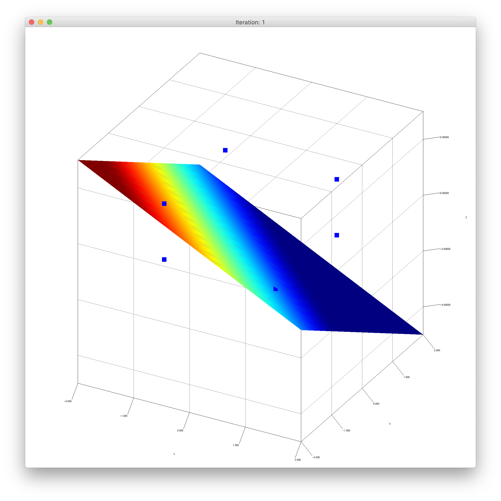
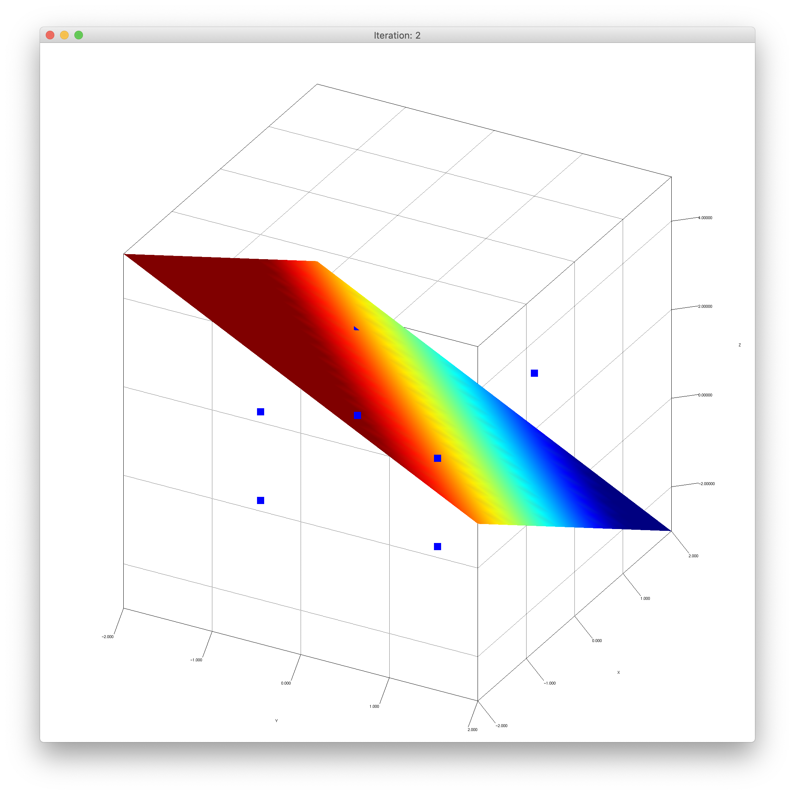
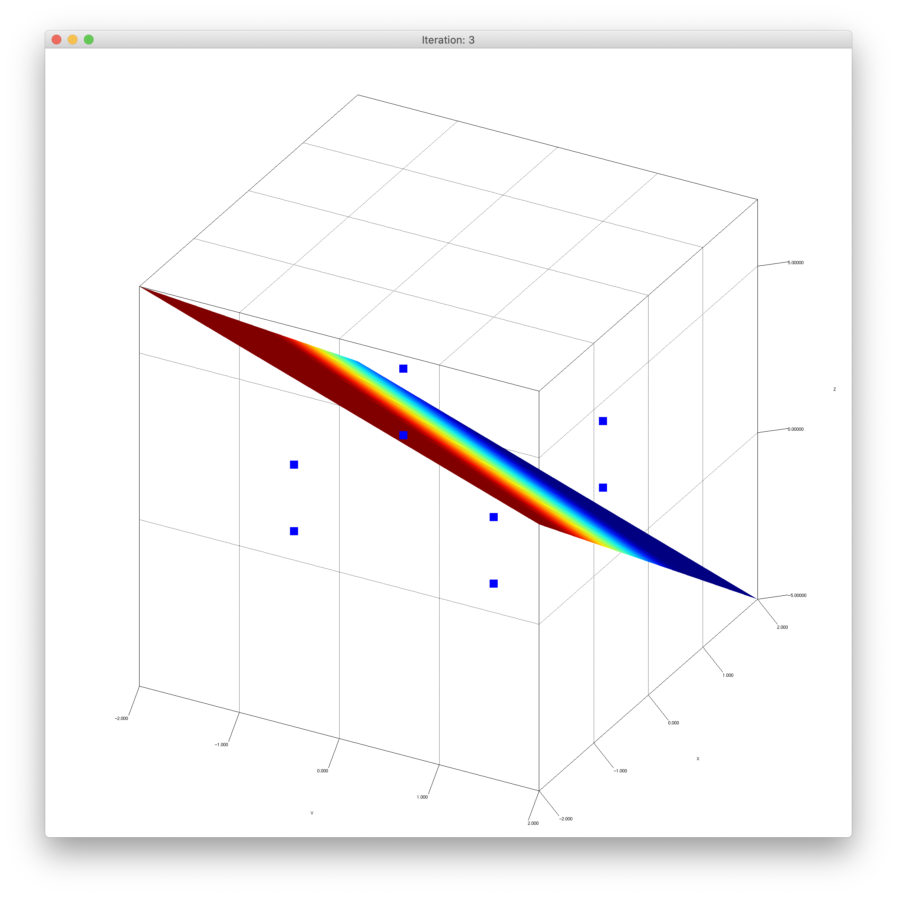
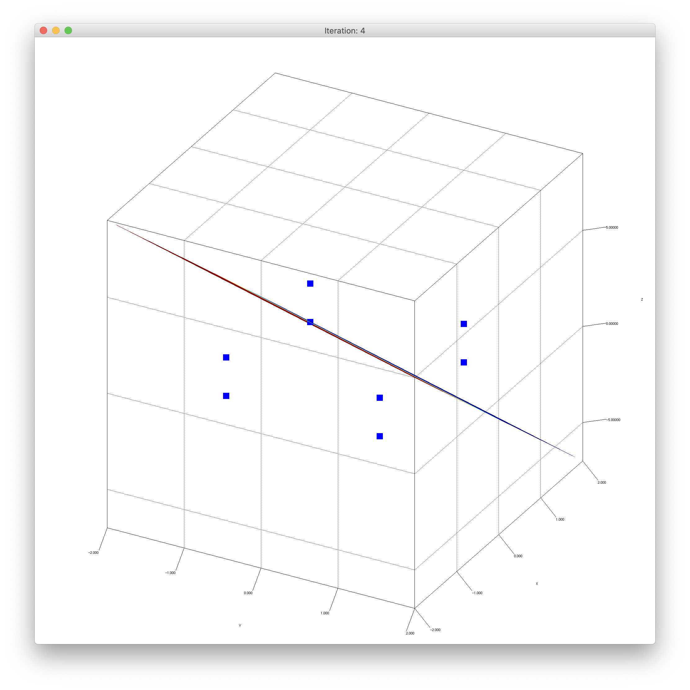
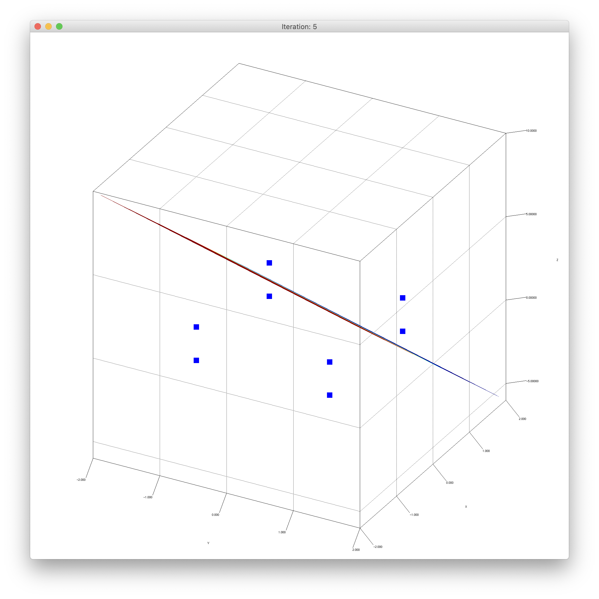
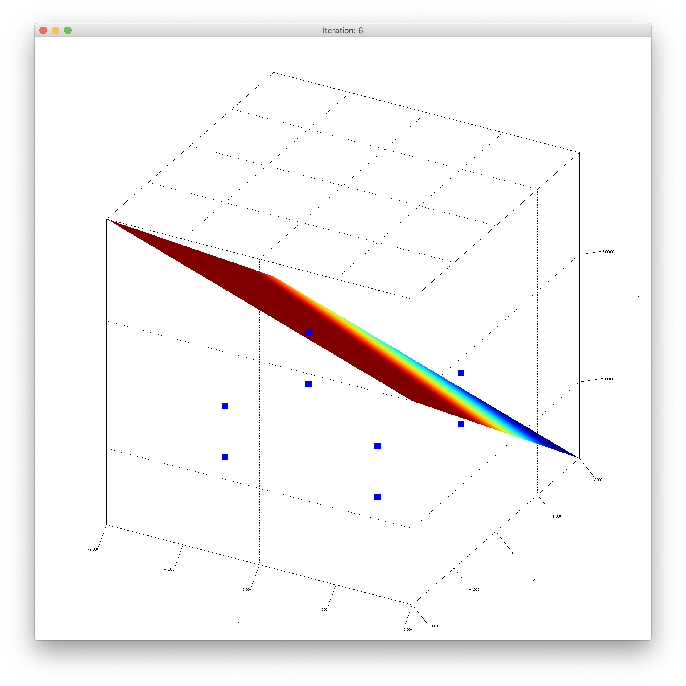

# Akka Playground

## Description

This repo contains a couple of programs that shows the basics of the Akka framework.

The AkkaBasics and ChatRoom programs are from the [Akka Tutorial](https://doc.akka.io/docs/akka/current/typed/actors.html).

The Perceptron project was written by me.

## Building

1. Install sbt
2. Run `sbt assembly`

### Running the Main Program

3. Run `java -jar ./target/scala-2.13/akkaBasics-assembly-0.1-SNAPSHOT.jar`

### Running the Perceptron Program

3. Run `java -cp ./target/scala-2.13/akkaBasics-assembly-0.1-SNAPSHOT.jar com.jplfds.perceptron.Main`

### Running the ChatRoom Program

3. Run `java -cp ./target/scala-2.13/akkaBasics-assembly-0.1-SNAPSHOT.jar com.jplfds.chat.Main`

## Perceptron

The perceptron example trains a perceptron to learn the NAND boolean operation.

After 6 iterations it learns to separate the input 1, 1, 1 from the others.

Below are the plots of the decision boundary after each training iteration:

Iteration 1:

 
 
Iteration 2:

 
 
Iteration 3:

 
 
Iteration 4:

 
 
Iteration 5:

 
 
Iteration 6:

      